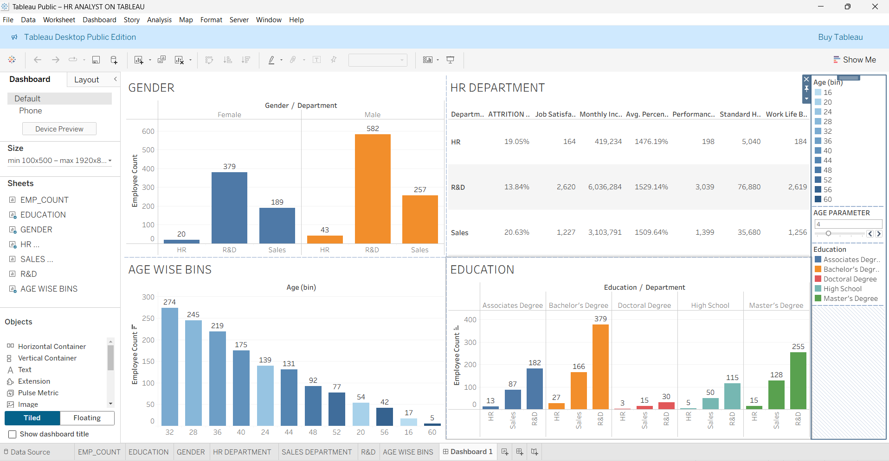

# HR-Analytics-Dashboard (Interactive Dashboard Creation Using tableau)

## Project Objective
The objective of this project is to analyze HR data using Tableau to identify key workforce trends such as employee attrition, headcount distribution, and demographic patterns, and to present actionable insights through interactive dashboards that support effective HR decision-making and strategic planning.

## Dataset used

- <a href ="https://github.com/udayasri009/TABLEAU_HR_Analytics_Dashboard/blob/main/HR%20Data.xlsx">Dataset</a>

## Questions (KPIS)
-Total Employee Count

-Attrition Rate (%)

-Employee Count by Department

-Employee Count by Gender

-Employee Count by Age Group (Bins)

-Employee Count by Education Level

-Average Monthly Income

-Job Satisfaction Score

-Performance Rating

-Work-Life Balance Score

-Standard Working Hours

## Dashboard Insight Questions
-What is the total employee count across departments?

-How is employee distribution split by gender across HR, R&D, and Sales?

-Which department has the highest attrition rate?

-How does attrition vary by department?

-What is the age-wise employee distribution?

-Which age group has the highest number of employees?

-How does education level vary across departments?

-Which department has the highest number of employees with a Bachelor’s / Master’s degree?

-Is there a relationship between age, education, and department?

-How do job satisfaction and work-life balance vary by department?

## Filters & Parameters Used

-Age (Bin) – Filter employees by age group

-Education Level – Associate, Bachelor’s, Master’s, Doctoral, High School

-Department – HR, R&D, Sales

-Gender – Male / Female

- Dashboard Interactions <a href = "https://github.com/udayasri009/TABLEAU_HR_Analytics_Dashboard/blob/main/HR%20ANALYST%20ON%20TABLEAU.twbx">View Dashboard</a>

## FORMULAS

🔹 1. Total Employee Count
   COUNT([Employee ID])

🔹 2. Attrition Count
SUM(
IF [Attrition] = "Yes" THEN 1 ELSE 0 END
)

🔹 3. Attrition Rate (%)
SUM(IF [Attrition] = "Yes" THEN 1 ELSE 0 END)
/ COUNT([Employee ID])

🔹 4. Active Employees
SUM(
IF [Attrition] = "No" THEN 1 ELSE 0 END
)

🔹 5. Employee Count by Gender
COUNT([Employee ID])

🔹 6. Employee Count by Department
COUNT([Employee ID])

🔹 7. Average Monthly Income
AVG([Monthly Income])

🔹 8. Job Satisfaction Score
AVG([Job Satisfaction])

🔹 9. Performance Rating
AVG([Performance Rating])

🔹 10. Work-Life Balance
AVG([Work Life Balance])

🔹 11. Standard Working Hours
AVG([Standard Hours])

🔹 12. Age Bin (Calculated – if not auto)
INT([Age] / 4) * 4

🔹 13. Age Bin (Using Parameter)
      Parameter Name: Age Bin Size
      INT([Age] / [Age Bin Size]) * [Age Bin Size]

🔹 14. Education-wise Employee Count
COUNT([Employee ID])

🔹 15. Gender-wise Attrition
SUM(
IF [Attrition] = "Yes" THEN 1 ELSE 0 END
)

🔹 16. Department-wise Attrition Rate
SUM(IF [Attrition] = "Yes" THEN 1 ELSE 0 END)
/ COUNT([Employee ID])

## DASHBOARD

## Project Insight

The HR Analytics Tableau dashboard reveals that attrition varies significantly across departments, with Sales showing the highest attrition rate. The workforce is predominantly concentrated in the 28–36 age group, and R&D has the highest employee count across genders and education levels. These insights help HR teams focus on targeted retention strategies, workforce planning, and data-driven decision-making.

## Final Conclusion

The HR Analytics dashboard provides a clear view of workforce distribution, attrition trends, and employee demographics. By analyzing department-wise, gender-wise, age-wise, and education-wise data, HR can make informed decisions to reduce attrition, improve employee satisfaction, and optimize talent management strategies.

